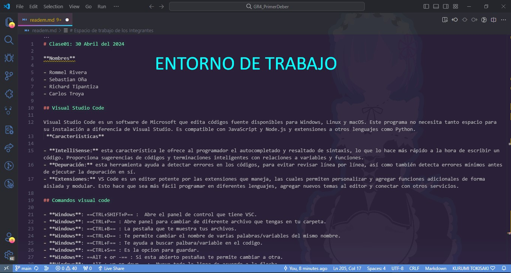
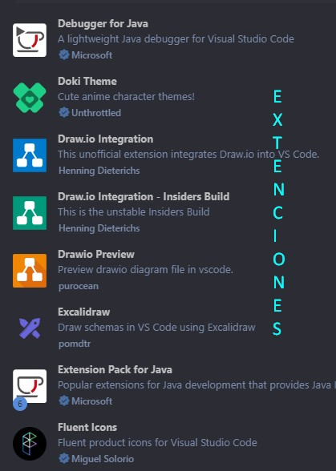
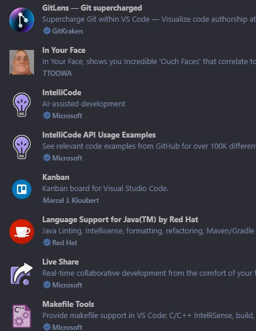
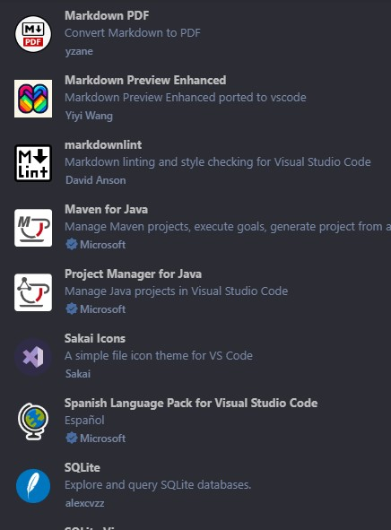
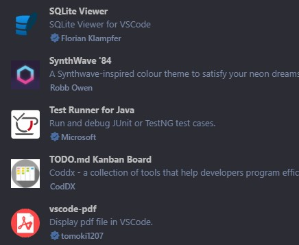
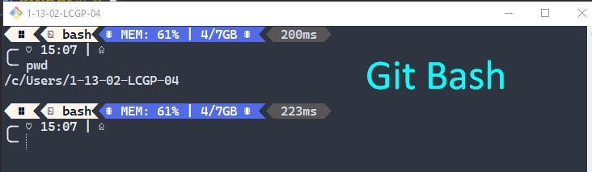
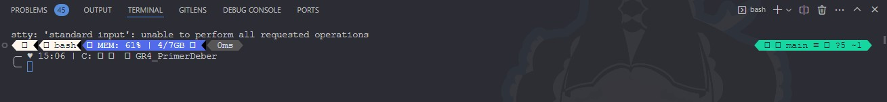

# Clase01: 30 Abril del 2024

**Nombres**

- Rommel Rivera
- Sebastian Oña
- Richard Tipantiza
- Carlos Troya

## Visual Studio Code

Visual Studio Code es un software de Microsoft que edita códigos fuente disponibles para Windows, Linux y macOS. Este programa no necesita tanto espacio para su instalación a diferencia de Visual Studio. Es compatible con JavaScript y Node.js y extensiones a otros lenguajes como Python.
 **Caracteriisticas**

- **IntelliSense:** esta característica le ofrece al programador el autocompletado y resaltado de sintaxis, lo que lo hace más rápido a la hora de escribir un código. Proporciona sugerencias de códigos y terminaciones inteligentes con relaciones a variables y funciones.
- **Depuración:** esta herramienta ayuda a detectar errores en los códigos, para evitar revisar línea por línea, así como también detecta errores mínimos antes de ejecutar la depuración en sí.
- **Extensiones:** VS Code es un editor potente por las extensiones que maneja, las cuales permiten personalizar y agregar funciones adicionales de forma aislada y modular. Esto hace que sea más fácil programar en diferentes lenguajes, agregar nuevos temas al editor y conectar con otros servicios.

## Comandos visual code

- **Windows**: ==CTRL+SHIFT+P== :  Abre el panel de control que tiene VSC.
- **Windows**: ==CTRL+P== : Abre panel para cambiar de diferente archivo que tengas en tu carpeta.
- **Windows**: ==CTRL+B== : La pestaña que te muestra tus archivos.
- **Windows**: ==CTRL+D== : Te permite cambiar el nombre de varias palabras/variables del mismo nombre.
- **Windows**: ==CTRL+F== : Te ayuda a buscar palbara/variable en el codigo.
- **windows**: ==CTRL+S== : Es la opcion para guardar.
- **Windows**: ==AlT + or -== : Si esta abierto pestañas te permite cambiar a otra.
- **Windows**: ==AlT + up or down== :  Mueve toda la linea de acuerdo a la flecha.

- **windows**: ==SHIFT+ALT+ up or down== : Copia toda la linea a la siguiente.
- **windows**: ==SHIFT+ALT+A== : Pone para comentar una linea.
- **windows**: ==CTRL+K+C== : Pondra toda la linea como comentario.
- **windows**: ==CTRL+T== : Permite mostrar todos los simbolos.
- **windows**: ==CTRL+SPACE== : Te ayuda autocompletar una palabra.
- **windows**: ==CTRL+x== :Borra una linea.
- **windows**: ==ClICK en el archivo + F2== : Cambia el normbre del archivo.

## Personalizacion de nuestro entorno de trabajo

Visual estudio nos permite configurar nuestra inferzas o entorno de trabja a nuestro gusto mediante una gran variedad de extensiones o opcion que posee el mismo visul studio code para esto veremos algunas extenciones que se pueden untilizar para esta personalizacion.

- **Extension para colocar icnonos a cada uno de nuestros archivos**


  - Aqui podemos ver como quedaria una carpeta con archivos e imagenes con iconos diferente para ser identificados de forma facil

        

## Uso del terminal y tambien del "Bash"

El terminal o consola es el entorno donde trabjamos directamente con lineas de comando


Este es el terminal por defecto que nos otorga visula studio code el cual pertecene a windows, es decir aqui podremos solo ejecutar comando que pertenezcan a este sistema operativo el cual lleva por nombre power shell

### Git Bash

Es una aplicación para entornos de Microsoft Windows que ofrece una capa de emulación para una experiencia de líneas de comandos de Git.

- **¿Qué es Blash?**
Bash es el acrónimo en inglés de Bourne Again Shell.

- **¿Qué es Shell?**
Es una aplicación de terminal que se utiliza como interfaz con un sistema operativo mediante comandos escritos.

## Comandos de la terminal

- <ins>pwd</ins> : Me permite saber en que directorio estoy trabajando.
- <ins>touch</ins> : Para crear un archivo.
*Ej: touch readme.md*
- <ins>code</ins> : Para crear archivos.
*Ej: code readme.md*
- <ins>touch **""** >> texto2.txt</ins> : Dentro de las comillas escribo lo que quiero que se escriba al crear el archivo -->
*EJ: touch "hola mundo" >> texto2.txt*

## Git y Github

<div style="overflow: hidden; display: flex; align-items: center;">
    <div style="float: left; width: 50%;">
        
    </div>
    <div style="float: right; width: 300%;">
     Git es un sistema de control de versiones rastrea los cambios que se han hecho en un conjunto de archivos es decir, un proyecto.
     <div style="float: right; width: 100%;">
     Github es un servicio que almacena repositorios en sus servidores y control de versiones usando git.
    </div>
    </div>

</div>

### Recomendaciones de otros comandos que tiene markdown

- Si queremos enumerar hacemos lo siguiente:
    1. Linea 1  
    2. Linea 2
        1. Linea 1
        2. linea 2
    3. Linea 3
- Si queremos poner otro signo para ideas hacemos lo siguiente:
  - Linea 1  
  - Linea 2
    - Linea 1
    - linea 2
  - Linea 3

# Clase03: 31 Abril del 2024

### Markdown

<p align="center">
  
</p>
Es un formato que nos permite generar archivos xtml y html utilizando una sintáxis bastante clara y sencilla y sobre todo fácil de escribir.

- markdown (para convertir a pdf mi markdown):
    1. Windows: CTRL+SHIFT+P
    2. Despues busco la opcion de "markdown export pdf"
    3. Se crea automaticamente un archivo pdf de tu markdown

- Para poner cursiva se debe encerrar entre asteriscos:

    \*palabra o texto* = *palabra o texto*  <!-- entre los asteriscos la palbra o el texto estara en cursiva -->
- Para poner en negrillas se debe encerrar entre doble asteriscos:

    \*\*palabra o texto** = **palabra o texto** <!-- entre los dos signos nos permite poner el todo un texto o una palabra en negrita -->
- Para poner cursiva y negrillas se debe encerrar entre triple asteriscos:

    \*\*\*palabra o texto*** = ***palabra o texto*** <!-- cursiva y en negrita -->
- Windows: ALT+9+6 (`) or windows: ALT+1+2+6 (~) <!-- crear este signo para lo siguiente -->
  - Nos permite poner una parte del codigo para analizar despues de (```) tenemos que poner el lenguaje de progrmacion.

    Ejemplos:

            1. 
                
                ``` java
                public int sumar(){
                int i=10;
                }
                ```
            2. 

                 ``` java
                public clas Hola{
                /* clase principal */
                    public class void main{
                        System.out.println();   
                    }
                }
                ```
- Para hacer cuadros:

  - Se organiza el texto en columnas y filas. Las filas se obtienen con salto de linea de texto y las columnas se obtienen encerrando el texto entre barras: |Texto|
  - Al finalizar la primera fila en donde tenemos los encabezados, se digita una siguiente fila de lineas entrecortadas para dar formato de titulo dentro de la tabla: |----|

        |Columna 1 | columna 2 |
        |----------|-----------|
        |     A    |      B    |
        |     C    |      D    |

    Para lo cual obtendremos:

    |Columna 1 | columna 2 |
    |---------|----------|
    |    A    |     B    |
    |    C    |     D    |
- Insertar link o enlace:

  - Si queremos solo insertar el hipervinculo al URL debemos encerrar entre <> la direccion.

        <https://www.google.com>
     De lo que obtenemos: <https://www.google.com>

  - Si queremos aplicar un hipervinculo a un texto con un direccion, el texto se encierra entre corchetes, el enlace entre parentesis y si deseamos aplicar un mensaje sobre el texto cuando se pose el cursor, se encierra dicho mensaje entre comillas.

        [Buscador](https://www.google.com "Google")
    De lo que obtenemos: [Buscador](https://www.google.com "Google")

- Comandos de git
    1. <ins>git init</ins> : Crea un carpeta oculta en tu carpeta de proyecto  y va aparecer tus archivo con "U".
    2. <ins>git status</ins> : Te muestra que archivos has guardado --> (rojo: no esta guardado and verde: esta guardado).
    3. <ins>git commit</ins> : Para guradar el proyecto.
    4. <ins>git checkout -b "Nombre de rama"</ins> : Crea y cambia de rama.
    5. <ins>git branch</ins> : Crea una rama.
    6. <ins>git push</ins> : Subo todo al github.
    7. <ins>git pull</ins> : Nos ayuda a traer los cambios hechos en la nube.
    8. <ins>git clone url</ins> : Baja el archivo de algun proyecto.
    9. <ins>git ignore</ins> : Dentro del archivo puedes poner archivos q va ignorar o no va a guardar.
    10. <ins>git config --global user.name "nombre"</ins> : Colocar nombre de ususario.
    11. <ins>git config user.name</ins> : Verificar si esta su nombre de ususario. (**Es lo mismo para el email solo cambia user.email**)
    12. <ins>git config --global init.default branch "main"</ins> : Cambiar de master a main.
    13. <ins>git commit -m Descripcion</ins> :Agregar cambios al repositorio local y una descripcion del cambio.
    14. <ins>git log</ins> :Muestra historial de commits. Si agregas "--oneline", aparece mas compacto.
    15. <ins>git add .</ins> : Agregar cambios al commit.
    16. <ins>git config --global core.editor</ins> : Asociar al vscode.
    17. <ins>git branch -m nombre actual nombre nuevo</ins> : Cambiar nombre de rama sin estar en la rama a la que se va a cambiar.
    18. <ins>git branch -d</ins> : Eliminar rama (locales no publicadas).
    19. <ins>git merge nombre-de-rama</ins> : Fusionar rama con main.
    20. <ins>git remote</ins> : Ver nombre del repositorio remoto.
    21. <ins>git fetch origin</ins> : Crear una rama local con los cambios de la rama remota.
    22. <ins>git push origin -d</ins> : Eliminar rama remota.

# Espacio de trabajo de los Integrantes:
 -<ins>==Richard Tipantiza==</ins>

<div style="display: flex;">
    
    
</div>


<div style="display: flex;">
    
    
</div>





